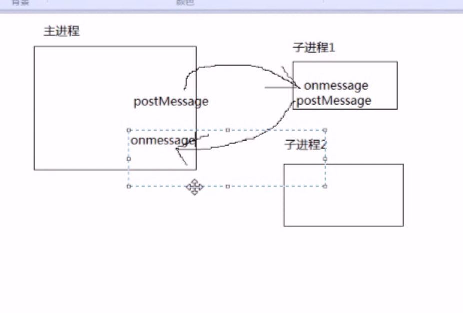
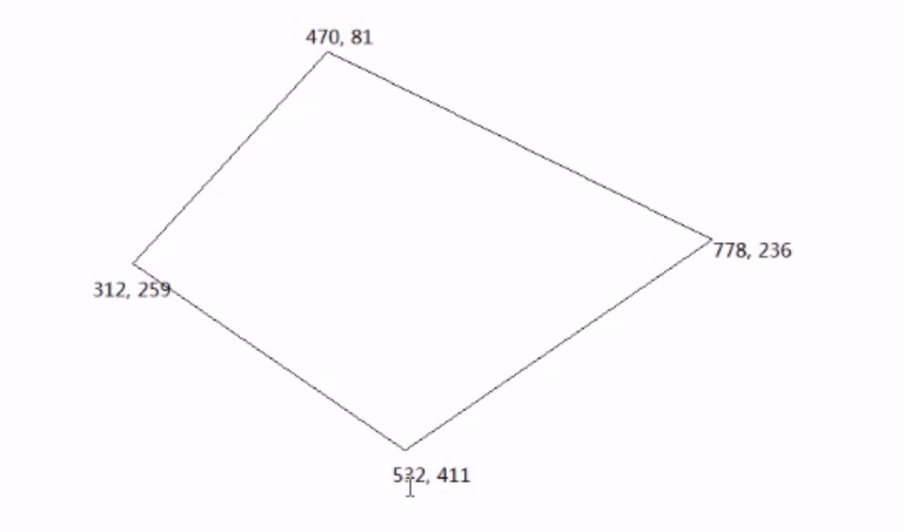

# HTML5 特性
@(智能社)

**geolocation —— 定位**
- 原理
	- PC：IP地址定位 精度非常差
	- 移动：GPS硬件定位 精度很高
- PC 
	- IP库 https://www.ipip.net/ 
	- Chrome -> 找google.com 来要的

```
console.log(window.navigator.geolocation) 
// geolocation有三个方法
getCurrentPosition（res=>{},err=>{},arg） 获取位置（1次）
watchPosition  不断获取位置
clearWatch 
```

**localStorage**
1. 域名、跨域
2. 用起来极其方便
3. 没有有效期 浏览器用的
4. 用途
	- 记录用户名
	- 存储草稿

- 遍历
```
 for(let i=0;i<localStorage.length;i++){
      let key=localStorage.key(i);

      alert(`${key}: ${localStorage[key]}`);
    }
```

**WebWorker —— web多进程**
主进程 —— ui进程
子进程 —— 工作进程

>1. webworker 不能控制ui的东西 数据交互OK
>2. 子进程不能再创建子进程
>3. 跨域


```
 <script>
    let oW=new Worker('1.js');

    oW.onmessage=function (ev){
      alert(ev.data);
    };

    oW.postMessage({n1: 25, n2: 99});
    </script>
```
```
// 1.js
this.onmessage=function (ev){
  let {n1, n2}=ev.data;

  let result=n1+n2;

  this.postMessage(result);
};
```

**webSQL indexDB **
> W3C 删掉了

**画图**
canvas		位图		html5标准
SVG		矢量图		独立标准
VML		矢量图		IE的矢量图

- canvas
> 图表 —— echarts
> 游戏
> 滤镜



```
let canvas = document.getElementById('canvas');
// 获取图像上下文
let context = getContext('2d');

// 路径操作 —— 类似于PS的选取 如果仅仅选取 不会有任何的效果

context.moveTo(470,81) // 起点
context.lineTo(778,236) // 连线
context.lineTo(532,411)
context.lineTo(312,259)
context.lineTo(470,81)	// 最后一条线 推荐用closePath
context.colsePath() // 最后一条线闭合

context.stroke() // 描边
context.fill() // 填充
context.lineWidth=20 // 线宽
context.strokeStyle = 'red' // 线的颜色
从text.fillStyle = 'yellow' // 填充颜色

```

