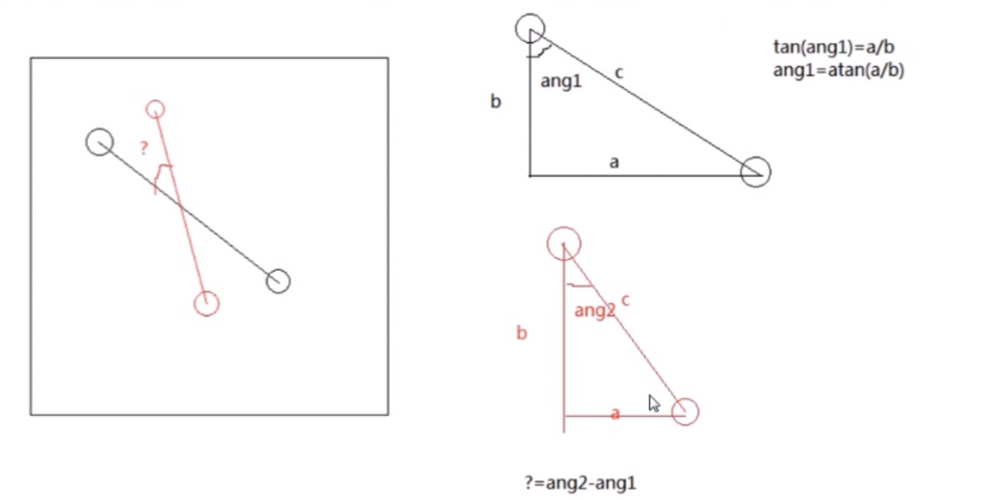

# 移动端开发

**移动端适配**
1. viewport 
```
<meta name='viewport' content='width=device-width,initial-scale=1.0,user-scalebale=no maximun-scale=1.0 minimun-scale=1.0'> 

适配设备宽度
默认缩放 
是否允许用户缩放
```

2. 盒模型
正常盒模型 盒子宽度 = width + padding + border （加 padding border 宽度变大往外扩 ）
```
// 盒子宽度 = width(加padding border 总大小不变往里挤)
/*
*好处 ：
*处理浮动更简便
*/ 
box-sizing:border-box
```

3. flex 弹性盒模型
> 天然是border-box
> 对 border、padding、margin 都好用
> 可以和max-width 、min-width配合

4. rem
> px 绝对大小
em 相对 自身大小
rem 相对 html 的 font-size
> 设置document.documentElement.style = document.documentElement.clientWidth/设计图宽度*默认html的fonts-size


**touch事件**
```
<script>
window.onload = function() {
let oBox = document.getElementsByClassName('box')[0];

oBox.addEventListener(
'touchstart',
function(ev) {
  let disX = ev.targetTouches[0].clientX - oBox.offsetLeft;
        let disY = ev.targetTouches[0].clientY - oBox.offsetTop;

  function fnMove(ev) {
     // 获取移动位置
     oBox.style.left = ev.targetTouches[0].clientX - disX + 'px';
     oBox.style.top = ev.targetTouches[0].clientY - disY + 'px';
   }
  function fnEnd() {
     oBox.removeEventListener('touchmove', fnMove, false); // 删除事件
     oBox.removeEventListener('touchend', fnEnd, false);
  }

  oBox.addEventListener('touchmove', fnMove, false); // 手指移动的时候设置新位置
  oBox.addEventListener('touchend', fnEnd, false); // 删除事件
          },
          false
        );
      };
    </script>
  </head>
  <body>
    <div class="box"></div>
  </body>
```

> 获取非行间样式的方法
> getComputedStyle(div,false).transform // 计算后的样式
改用transform

```
<script>
    window.onload=function (){
      let oBox=document.getElementsByClassName('box')[0];
      let x=0,y=0;

      oBox.addEventListener('touchstart', function (ev){
        let disX=ev.targetTouches[0].clientX-x;
        let disY=ev.targetTouches[0].clientY-y;

        function fnMove(ev){
          x=ev.targetTouches[0].clientX-disX;
          y=ev.targetTouches[0].clientY-disY;

          oBox.style.transform=`translate(${x}px,${y}px)`;
        }
        function fnEnd(){
          oBox.removeEventListener('touchmove', fnMove, false);
          oBox.removeEventListener('touchend', fnEnd, false);
        }

        oBox.addEventListener('touchmove', fnMove, false);
        oBox.addEventListener('touchend', fnEnd, false);
      }, false);
    };
    </script>
  </head>
  <body>
    <div class="box"></div>
  </body>
```

**多点触摸**
- targetTouches —— 当前物体上的手指的数组 
	- 两个物体上的物体的手指不会互相干扰
- touches —— 一般不用 算的是所有屏幕上的手指

- 平均位置
	- 在就物体移动 不需要多点的时候 当有多个手指触碰同一个物体的时候 算一个物体上的手指的平均位置 这样就相当于一个手指

- 应用
	- 避免影响  —— 消除干扰 
		- 平均坐标
	- 需要多点 —— 手势
		- 缩放
		- 旋转

- 旋转
>角度：360°
弧度：2π
1° = π/180°


- 缩放


- 多手指  —— 说实话 意义不大
	- 不较真的话 就只接受两个手指 多于两个手指就不动
	- 较真的话 我真不想较真 过

- 移动端真机测试
	1. Chrome —— 测试一些简单的东西
	2. 模拟器 —— 夜神（win）
	3. 真机测试
		-  服务器 
		-  browsersync 
			-  browser-sync start
		-  dev-server


